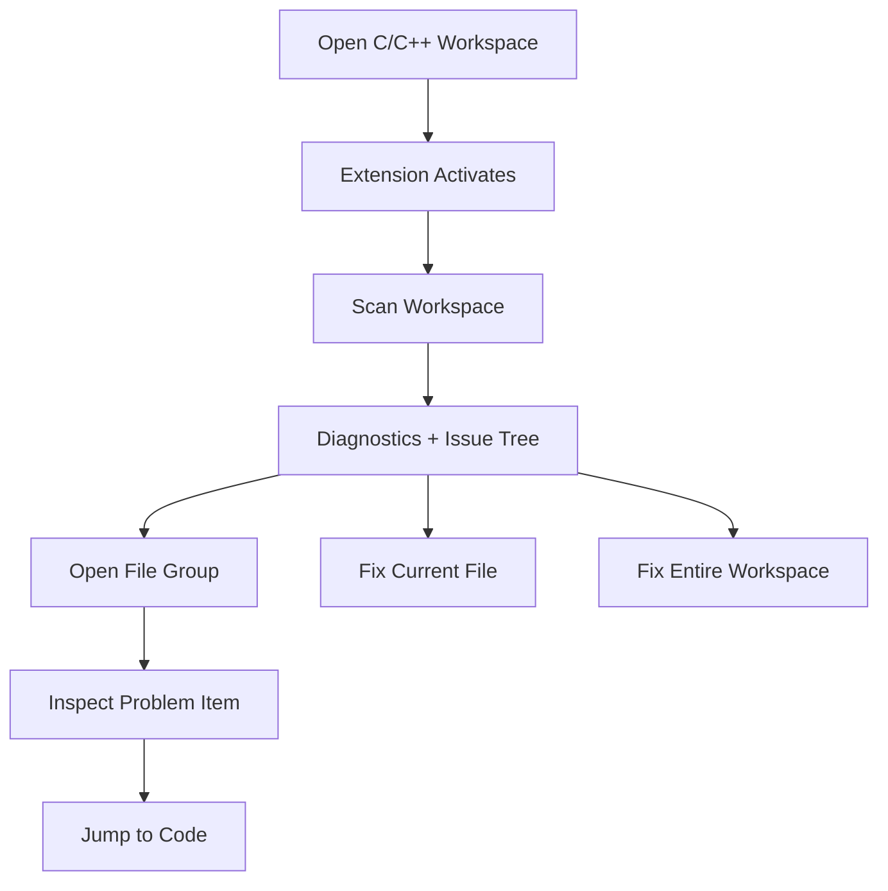

<div align="center">

# C++ Code Checker

<p>
  <strong>A workspace-first VS Code extension for large-scale C/C++ rule scanning, issue navigation, and safe one-click fixes.</strong>
</p>

<p>
  <a href="https://github.com/HecreReed/codecheck/releases/latest">
    
  </a>
  <a href="https://github.com/HecreReed/codecheck/blob/main/LICENSE">
    
  </a>
  
  
</p>

<p>
  <em>Built for teams who want the scanner to feel like a cockpit, not a checkbox.</em>
</p>

</div>

---

## What It Feels Like

This extension is designed around a simple promise:

> Open a C/C++ workspace, scan once, and immediately get a dedicated issue panel that shows exactly which files are problematic, what went wrong, and what can be fixed with one click.

It does not depend on shipping the original Excel rules file at runtime.  
The ruleset is embedded as a generated snapshot, so the `.vsix` stays portable and behaves consistently across different machines.

## Why This Build Is More Reliable

The newest version explicitly addresses the “same project, different machine, different result” problem:

- The extension now activates on startup as a fallback, not only after opening a C/C++ file.
- Workspace activation covers `.cpp`, `.cc`, `.cxx`, `.c`, `.h`, and `.hpp`.
- The issue panel no longer silently looks “clean” before a scan finishes.
- Workspace changes and trust changes can trigger a fresh scan path.
- The release package no longer depends on a raw `.xlsx` file being present on disk.

## Feature Surface

| Area | What You Get |
| --- | --- |
| Workspace Scan | Scan the entire project and collect diagnostics for all supported C/C++ files |
| Issues Panel | Dedicated `C++ Checker Issues` tree view grouped by file |
| Code Navigation | Click an issue item to jump directly to the exact line |
| File Actions | Right-click a file to scan or fix just that file |
| Workspace Actions | Trigger workspace-wide scan or workspace-wide fix from the issue view |
| Safe Auto Fix | Automatically fixes rules that can be changed without guessing intent |
| Snapshot Ruleset | Ships with an embedded rules snapshot for portable behavior |

## Interface Highlights

### 1. Workspace Issue Console

The Explorer side bar contains a dedicated panel:

- `C++ Checker Issues`
- grouped by file
- per-issue child rows with line number and code snippet
- direct click-to-jump navigation
- toolbar actions for workspace scan and workspace fix

### 2. Right-Click File Actions

In Explorer and in the editor context menu:

- `C++ Checker: Scan Current File`
- `C++ Checker: Fix Current File`

### 3. Keyboard Shortcut

For full workspace scan:

- Windows / Linux: `Ctrl+Alt+Shift+S`
- macOS: `Cmd+Alt+Shift+S`

## Workflow



## What Gets Fixed Automatically

The extension intentionally separates “detectable” from “safe to auto-rewrite”.

Examples of fixable cases include:

- missing license header insertion
- removal of warning suppression directives
- moving `using namespace` below `#include` blocks

Examples of detect-only cases include:

- format string type mismatches
- unsafe API usage that requires developer intent
- memory/security findings that need semantic review

## Supported Rule Coverage

This build aligns with the MR ruleset snapshot embedded in the extension, including:

- duplicated Excel rule IDs and C/C++ mirrored IDs through alias mapping
- split handling for `G.FUU.12`
- split handling for oversized function / nesting / complexity
- workspace-level checks such as duplicate files and oversized directories

## Quick Start

### Install From VSIX

```bash
code --install-extension cpp-code-checker-0.2.0.vsix
```

### Run In VS Code

1. Open any C/C++ project folder.
2. Wait for the extension to activate.
3. Open the `C++ Checker Issues` panel in the Explorer.
4. Click `Scan Workspace`, or use the shortcut:

```text
Ctrl+Alt+Shift+S
Cmd+Alt+Shift+S
```

5. Use:
   - `Fix Current File`
   - `Fix All Auto-fixable Issues in Workspace`

## Commands

| Command | Purpose |
| --- | --- |
| `C++ Checker: Scan Workspace` | Full workspace scan |
| `C++ Checker: Scan Current File` | Scan only the selected/open file |
| `C++ Checker: Fix Current File` | Fix safe issues in one file |
| `C++ Checker: Fix All Auto-fixable Issues in Current File` | Alias to single-file fix flow |
| `C++ Checker: Fix All Auto-fixable Issues in Workspace` | Apply safe fixes across the workspace |

## Configuration

| Setting | Description |
| --- | --- |
| `cppChecker.autoScanWorkspaceOnActivate` | Scan the full workspace when the extension starts |
| `cppChecker.autoScanWorkspaceOnSave` | Re-scan the workspace when a C/C++ file is saved |
| `cppChecker.maxHeaderLines` | Threshold for oversized headers |
| `cppChecker.maxSourceLines` | Threshold for oversized source files |
| `cppChecker.maxFunctionLines` | Threshold for oversized functions |
| `cppChecker.maxNestingDepth` | Threshold for deep nesting |
| `cppChecker.maxCyclomaticComplexity` | Threshold for complexity |
| `cppChecker.maxFilesPerDirectory` | Threshold for oversized directories |
| `cppChecker.licenseHeader` | Custom first-line license header |

## Local Development

```bash
npm install
npm run compile
npm run test:smoke
npm run package:vsix
```

### Debug With F5

1. Open this repository in VS Code.
2. Press `F5`.
3. Choose `Run Extension`.
4. A new `Extension Development Host` window will appear.
5. In that new window, open a real C/C++ project.
6. Use the issue panel, right-click menus, or the scan shortcut.

## Release Artifacts

- Repository: [HecreReed/codecheck](https://github.com/HecreReed/codecheck)
- Releases: [GitHub Releases](https://github.com/HecreReed/codecheck/releases)
- Packaged extension: `cpp-code-checker-0.2.0.vsix`

## Smoke-Tested Paths

The automated smoke test currently verifies:

- extension activation
- workspace scan
- single-file scan
- single-file fix
- workspace fix
- `.vsix` installation flow

## Philosophy

This project is trying to make static checking feel operational:

- broad workspace visibility
- sharp file-level controls
- safe fix automation
- predictable behavior on different machines

If a scanner is powerful but people do not trust what they are seeing, they stop using it.  
This extension is optimized as much for confidence as for detection.
